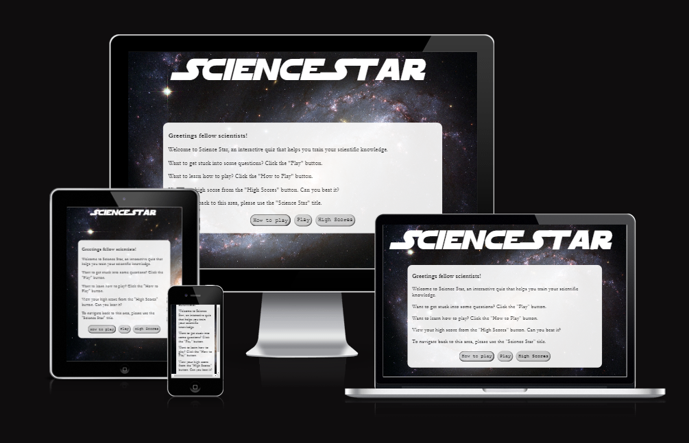
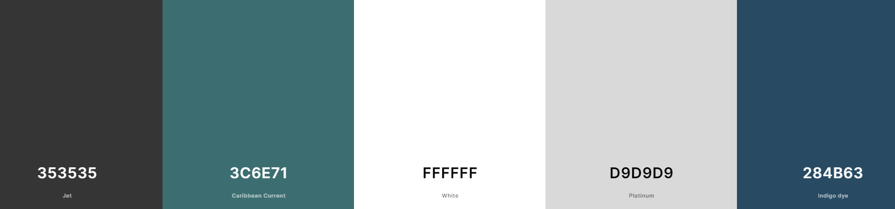
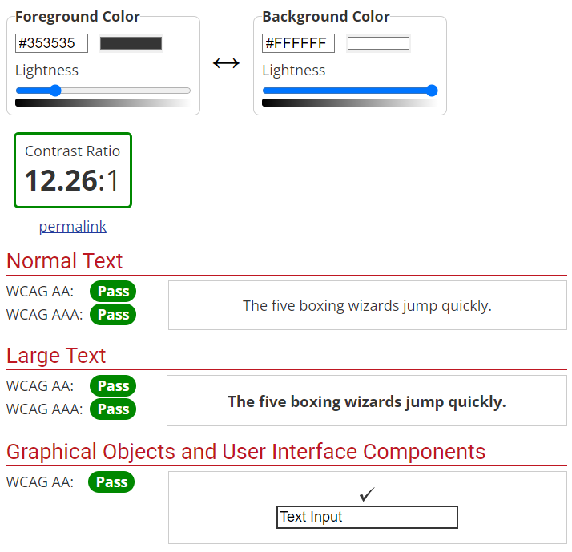
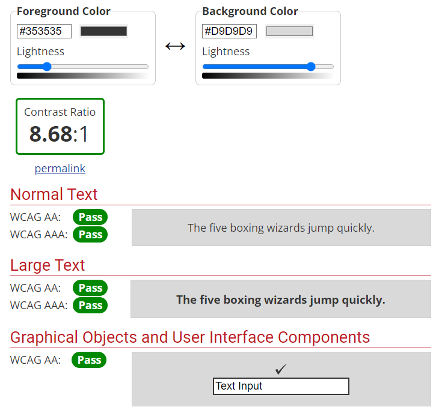

# Science Star

Visit the deployed site: [Science Star](https://tomes2000.github.io/Science-Star-CI//)

## User Experience (UX)

### User Stories

#### First Time Visitor Goals

1. `"I want to know what the website does upon my first visit, so that I can decide whether I'm interested in utilising it."`

2. `"I want to improve my science skills to improve my capabilities for exams or personal knowledge."`

3. `"I want to be able to play at any time and on any device."`

4. `"I want the site to be responsive to my specific device, especially as a mobile user."`

5. `"I want the site to be easy to naviagate."`

#### Returning Visitor Goals

* `"I want to be able to challenge myself by being able to adjust the difficulty level to improve my knowledge."`

* `"I want to be able to upload my highscore and track my progress."`

### Porject Strategy Summary

### Ideal User

Any individual with the desire to increase their scientific knowledge.

### Project Goal

The concept behind Science Star is to provide a fun and interactive website for users to test their knowledge, learn new concepts and have fun whilst doing so. The high score function allows competitveness to propser, which entices the user to have a desire to beat their high score.

#### User Requirements
1. To be able to nagivate the site easily and efficiently.
2. To be able to see whether an answer was correct and if not, see which other option was correct.
3. To be able to record high scores.

#### Project Objectives
1. Allow users a simple way to learn and practice science in an interactive and dynamic way.
2. Allow for an incentive for returning visitors to use this site consistently.
3. Allow for the user to be engaged so that they pick this site over other sites.
4. Allow the user to navigate and control the site easily.

### Design

#### Typography

Logo font: Star Wars font was chosen for the logo. This is due to its relation to space, stars and science, which ties in really well the concept of Science Star.

Body font: Courier New font was chosen for the body font due to its quirky visuals that are designed to excite the user. 

#### Imagery

The website is called Science Star; the name is designed to reassure the user that they can become a skillful scientist from participating in this quiz. As a result, I've used an image of *blank* (change this) to show user *blank*.

#### Features

The website is comprised of a home page, game page, high score page, 500 error page and 404 error page.

All pages on the website are responsive and include:

* A favicon in the browser tab.

* The website title that allows the user to navigate back to the home page if they so require.

#### The Home Page

The home page of Science Star displays the title at the top, with a container just below which features the content.  This content allows the user to interact with the quiz and also welcomes them upon their visit. There are three buttons featured which include: "Play", "How To Play" and "High Scores".

The "Play" button will take the user to the game page, where they can select the difficulty of the quiz and also a high scores button, which allows them to track their progress.

A modal feature has been implemented when the "How To Play" button is pressed. This puts the content outside of the modal out of focus, helping the user concentrate on the content enclosed within the modal.

##### How to Play Modal

Within the home page, there is a "how to play" modal, which gives the user instructions on how to use the mechanics within the quiz. The rest of the background outside of the modal is blurred to allow the user to focus on the content within the modal.

#### The Game Page

The game page of Science Star displays the title at the top, which allows the user to navigate back to the home page. Within the game page, the user has the option of choosing their respective difficulty.

Once the difficulty has been chosen, the quiz begins and the user is introduced to the quiz section which contains questions with 4 possible answers to choose from. 

The user then has one chance to correctly answer the question, once they click an answer, they are unable to re-select a different answer. If the user is correct then the quiz border section along with the button will display a green colour along with adding 10 to the score total. If the user is incorrect, then the quiz border section along with the button will display a red colour and 0 points are added to the score total.

There are a total of 10 questions. Once all 10 questions are answered, the user is redirected to the final seciton, allowing them to write their details and submit their score onto the high score page. A total of 10 scores can only be displayed, therefore the top 10 scores are only shown. Disabling the submit button until a high score name is entered prevents the user from submitting an empty field.

#### 404 Error Page

The 404 error page of Science Star displays the title at the top, with a container just below which features the content.  This content contains a message telling the user that "There seems to be an issue with the page you were looking for!". The user then has the choice of going back to the home page, games page or the high scores page.

#### Modals

Modals are utilised in the site via Bootstrap to provide an additional degree of user interactivity. Here, I've used a modal to that contains instructions on how to play the game for the user. A useful feature that I've implemented is blurring the background, which allows the user to focus solely on the content within the modal.

#### 500 Error Page

The 500 error page of Science Star displays the title at the top, with a container just below which features the content.  This content contains a message telling the user that "Quiz data retrival error!" and to try again later. The user then has the choice of going back to the home page or the high score page. The user should not be sent to the play page as 500 error pages are caused by API errors.

#### Colour Scheme

White and black are very good colours to represent space and have been used extensively throughout my project. I have used red and green within css for the purpose of showing correct and incorrect answers.

##### Green

A darkish shade of green (#36C6E71) has been used due to its symbolism of [life, nature and balance](https://www.sensationalcolor.com/meaning-of-green/). This colour works very well with my idea of science as it's related to life and nature. This same colour was also included into the correct answer Buttons and Borders.

##### White

A simple white (#FFFFFF) was chosen for the title, modal and outer container background colour due to its pure and easy visualisaiton.

##### Black

In order to comply with WCAG 2.0, a rich black colour (#353535) was chosen for primary text throughout the website. This resulted in a 12:26  ratio for black on white.

##### Gray

In order to comply with WCAG 2.0, a rich gray colour (#D9D9D9) was chosen for buttons throughout the website. This resulted in a 8.68  ratio for black on gray.

In addition to this, gray pairs really well with black and white and actually adds depth and visual interest to the buttons.

#### Background Image

After conducting user testing and feedback sessions, the realisation that a plain green (#36C6E71) background was not very popular and resulted in a monotonous and dull user experience. As a result, I've included a vibrant image in the background of the website.

This image focuses on the galaxies and stars of the universe, which ties in very well with the title "Science Star". In addiiton to this, the colour scheme is mainly a rich black colour with dotted white, red and yellow stars. 

#### Accessibility

A website should be extremely accessible for people with disabilities. Ways that I have ensured that I have ensured accessibility are as follows:

- Easy to navigate interface
- Semantic HTML
- Simple and plain colours
- Hover ability on all buttons
- Safe colour contrast
- Sans serif font for dyslexic users

## Deployment & Local Development

### Deployment

The site is deployed using GitHub Pages - [Science Star](https://tomes2000.github.io/Science-Star-CI//).

To Deploy the site using GitHub Pages:

1. Login (or signup) to Github.
2. Go to the repository for this project, [tomes2000/Science-Star-CI](https://github.com/tomes2000/Science-Star-CI.git).
3. Click the settings button.
4. Select pages in the left hand navigation menu.
5. From the source dropdown select main branch and press save.
6. The site has now been deployed, please note that this process may take a few minutes before the site goes live.

### Local Development

#### How to Fork

To fork the repository:

1. Log in (or sign up) to Github.
2. Go to the repository for this project, [tomes2000/Science-Star-CI](https://github.com/tomes2000/Science-Star-CI.git)
3. Click the Fork button in the top right corner.

#### How to Clone

To clone the repository:

1. Log in (or sign up) to GitHub.
2. Go to the repository for this project, [tomes2000/Science-Star-CI](https://github.com/tomes2000/Science-Star-CI.git)
3. Click on the code button, select whether you would like to clone with HTTPS, SSH or GitHub CLI and copy the link shown.
4. Open the terminal in your code editor and change the current working directory to the location you want to use for the cloned directory.
5. Type 'git clone' into the terminal and then paste the link you copied in step 3. Press enter.