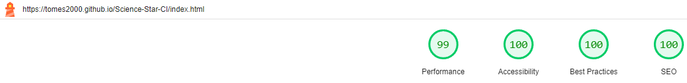
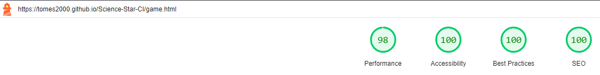
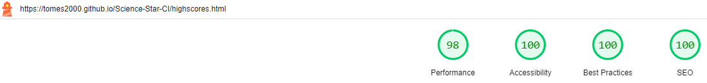
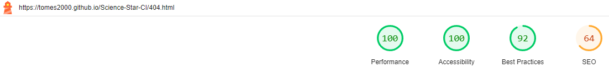
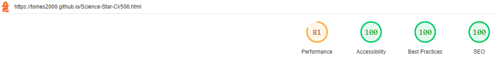

# Science Star - Testing Document

## User Story Testing

First time visitors 

### "I want to know what the website does upon my first visit, so that I can decide whether I'm interested in utilising it."

Achiement: When the user first visits the website they are presented with the logo "Science Star", which explains the science nature of the quiz. In addition to this, the site also has an over view explaining its purpose. Lastly, to eliminate any confusion at all, there is also a set of instrucitons for the user explaining how to interact with the quiz.

Outcome: **Pass**

### "I want to improve my science skills to improve my capabilities for exams or personal knowledge."

Achievement: I have ensured that the user can receieve instant feedback of their results from the quiz based on a score counter and also red & green colours to indicate whether an answer was correct or not.

Outcome: **Pass**

### "I want the site to be easy to naviagate."

Achievement: The user is presented with a simple UI which is simple to navigate and there are instructions explaining to them that they can return back to this page by clicking on the top title. In addition to this, the hover function is extremely useful in helping the user ensure that they are aware of what they are selecting.

Outcome: **Pass**

### "I want the site to be responsive to my specific device, especially as a mobile user."

As the website utilises Bootstrap for its foundation, most of the structure natively adapts to a user's viewport, allowing native compatibility on any screen size. 

Outcome: **Pass**

Returning visitors

### "I want to be able to challenge myself by being able to adjust the difficulty level to improve my knowledge."

Achievement: The difficulty button within the quiz allows the user to be mentally challenged, or maybe make the quiz easier if they think it is too difficult so that they can go along in in ther own pace.

Outcome: **Pass**

### "I want to be able to upload my highscore and track my progress."

Achievement: The user can write their details down at the ends of the quiz and it will be displayed within the high scores list. Only the top 10 can be displayed.

Outcome: **Pass**

## Code Validation

Code Validation was completed via third party applications, in order to assess the markdown syntax and logical application of the languages used.

1. [**W3 Markup Validation**](https://validator.w3.org/) – HTML Validation

  - The project's HTML was validated using the automated W3 Markup Validator at intervals throughout the development process.
  - At no point were Errors presented.
  - At final deployment, no Errors or Warnings are present.

2. [**W3 Jigsaw**](https://jigsaw.w3.org/css-validator/) – CSS Validation

  - The project's CSS was validated using the automated W3 Jigsaw Validator at intervals throughout the development process.
  - One Error was identified, regarding the auto not being defined by any specification as an allowed value for pointer-events, but since this is allowed in multiple browsers I'm not too worried about this issue.

3. [**JSHint**](https://jshint.com/) - JS Validation

  - The project's JavaScript was validated using the open source automated service, JSHint, at intervals throughout the development process.
  - All three Javascript files passed, however game.js experienced one warning message due to Async functions which are only available in ES8, but I'm not too worried about this issue. Any other warning messages are due to ES6 Compatibility; I'm aware of these and am satisfied these can be dismissed.

### Lighthouse

Lighthouse was used to investigate the performance, accessibility, best practices and SEO of the website.

### Desktop Results

All scores are positive

### Mobile Results

Lighthouse was used to investigate the performance, accessibility, best practices and SEO of the website.

All scores are positive.

## Responsive Layout & Design

Testing was completed with Chrome Development Tool's `Device Toolbar`.

Testing was conducted on the following devices:
  - Computer (22 inch screen)
  - Moto G4
  - Galaxy S5
  - Pixel 2
  - Pixel 2XL
  - iPhone 5/SE
  - iPhone 6/7/8 (and plus)
  - iPhone X
  - iPad
  - iPad Pro
  - Surface Duo
  - Galaxy Fold

For each device tested, I used the following browser:
- Internet Explorer 11
- Chrome/Firefox/Edge
- Safari

No issues were reported

`index.html`

| Feature | Expected Outcome | Testing Performed | Result | Pass/Fail |
| --- | --- | --- | --- | --- |
| The Sites title | Links back to home page | Clicked title | Back to Home Page | Pass |
| How to play button | Modal with instructions pops up | Click on button | Modal with instructions on how to play opens | Pass |
| Modal close button | Closes the modal | Click on close button | Modal closed | Pass |
| Play Button | Directs the user to the game page | Click on button | Game page opens with difficulty selection | Pass |
| High Scores Button | Direct the user to the high scores page | Click on button | Directs to the high scores page | Pass |
| All buttons - hover effect | All gray buttons with black text should change to a slight green gue when hovered over. | Hover over each button on the page | Each button displayed the correct styling when hovered over | Pass |
| 🌟 Cursor | 🌟 displays when hovered over on button | Moved the mouse over each button to check the cursor changed after hovering on button | The cursor changed from the arrow to the 🌟 cursor | Pass |

`game.html SECTION`
`Main quiz - Content`

| Feature | Expected Outcome | Testing Performed | Result | Pass/Fail |
| --- | --- | --- | --- | --- |
| The Sites title | Links back to home page | Clicked title | Back to Home Page | Pass |
| All buttons - hover effect | All gray buttons with black text should change to a slight green gue when hovered over. | Hover over each button on the page | Each button displayed the correct styling when hovered over | Pass |
| 🌟 Cursor | 🌟 displays when hovered over on button | Moved the mouse over each button to check the cursor changed after hovering on button | The cursor changed from the arrow to the 🌟 cursor | Pass |
| Question populated | The question from the API is correctly pulled from the JSON data | console.log the data and check that the question has been pulled correctly | The question is displaying | Pass |
| Answers populated | The answers from the API are correctly pulled from the JSON data | console.log the data and check that the answers have been pulled correctly | The answers are displaying | Pass |
| Data attribute correct | The data attribute correct has been applied to the correct answer | By console logging the data I am able to check what the correct answer should be. I can then console.log the id of the buttons to check whether the data attribute has been applied only to the button containing the correct answer | only the correct answer has the correct attribute | Pass |
| Correct answer - border colour | When a correct answer is clicked the border around the game area should display green | Clicked on a correct answer | Border displayed green | Pass |
| Incorrect answer - border colour | When an incorrect answer is clicked the border around the game area should display red | Clicked incorrect answer | Border displayed red | Pass |
| Correct answer - button colour | When a correct answer is clicked the button should change background colour to green | Clicked a correct answer | Button background turned green | Pass |
| Incorrect answer - button colour | When an incorrect answer is clicked the clicked buttons background should turn red | Clicked incorrect answer | Button background turned red | Pass |
| Incorrect answer - display correct answer | When an incorrect answer is clicked, the correct answer should display a green background | Clicked incorrect answer | The correct answer turned green | Pass |
| Question number counter | The question number counter should start at 1 and increase by 1 time with each question | Clicked next button and watched the counter increase | Each time the next button is clicked the answer number counter increases by 1. | Pass |
| Score Counter | The score counter should begin at 0. Each time a correct answer is selected the score should increase by 10. If an incorrect answer is selected the score should remain the same | Clicked a correct answer to check if the score increased. Clicked an incorrect answer to check the score stayed the same| When a correct answer was selected the score increased by 10. When an incorrect score was selected the score stayed the same | Pass |
| Not Allowed Cursor | Once an answer has been selected, the answer buttons should then be disabled and when hovered over the not allowed cursor will display | Clicked on one answer button and then clicked on the remaining answer buttons | After the answer was selected each answer button clicked on subsequently displayed the not allowed cursor | Pass |
| Next button - becomes visible | When an answer is clicked the next button should be displayed so the user can progress to the next question, or to the end section if all 10 questions have been answered| Clicked on an answer button | The next button displayed | Pass |
| Next button hover effect | A button with a white background & black text should change to a button with a black background & white text when hovered over.| Hovered over the button | Style changed as expected | Pass |
| Next button - clicked | When clicked all answer styles should be removed, the next button should become hidden again and a new question and answer loaded if there are questions left. If all questions have been answered the end game should appear | Clicked on the next button | All styles were removed and a new question and answers were displayed. After question 10 was answered I was taken to the end game. | Pass |

`Main quiz - Difficulty selection`

| Feature | Expected Outcome | Testing Performed | Result | Pass/Fail |
| --- | --- | --- | --- | --- |
| The Sites title | Links back to home page | Clicked title | Back to Home Page | Pass |
| All buttons - hover effect | All gray buttons with black text should change to a slight green gue when hovered over. | Hover over each button on the page | Each button displayed the correct styling when hovered over | Pass |
| 🌟 Cursor | 🌟 displays when hovered over on button | Moved the mouse over each button to check the cursor changed after hovering on button | The cursor changed from the arrow to the 🌟 cursor | Pass |
| Easy Button | Calls the easy quiz URL for the API | Do console.log(data) and check the data from the API matches the level called | Check that `difficulty: easy` is shown | Pass |
| Medium Button | Calls the medium quiz URL for the API | Do console.log(data) and check the data from the API matches the level called | !Check that `difficulty: medium` is shown | Pass |
| Hard Button | Calls the hard quiz URL for the API | Do console.log(data) and check the data from the API matches the level called | Check that `difficulty: hard` is shown | Pass |

`Main quiz - Ending`

| Feature | Expected Outcome | Testing Performed | Result | Pass/Fail |
| --- | --- | --- | --- | --- |
| The Sites title | Links back to home page | Clicked title | Back to Home Page | Pass |
| All buttons - hover effect | All gray buttons with black text should change to a slight green gue when hovered over. | Hover over each button on the page | Each button displayed the correct styling when hovered over | Pass |
| 🌟 Cursor | 🌟 displays when hovered over on button | Moved the mouse over each button to check the cursor changed after hovering on button | The cursor changed from the arrow to the 🌟 cursor | Pass |
| Score Display | Score populates with the score achieved | Checking the scores and adding them as the quiz was utilised | The score displays correctly | Pass |
| Submit Button - enabled/disabled | The submit button should be disabled and show the not allowed cursor by default. Once the user types their  name into the input field the button is enabled | I hovered over and clicked the submit button without filling in the  name field. I then added a  name, hovered over and clicked the submit button | Without a name filled in the cursor displays as not allowed and the button will not submit. Once I filled in a name the cursor became a 🌟 when hovered over the button and I was able to click and submit the score | Pass |
| Submit button - on submit | Once clicked the submit button will redirect you to the high scores page | Clicked the button with the team name filled in | Redirected to the high scores page | Pass |
| Play again? button | Clicking on this button will return you to the start of the game page where you can select a quiz difficulty level | Clicked on the play again? button | Directed to the beginning of the game to select a difficulty level | Pass |
| Home button | Clicking on this button will take you back to the home page | Clicked the home button | Directed back to the home page | Pass |

`highscores.html`

| Feature | Expected Outcome | Testing Performed | Result | Pass/Fail |
| --- | --- | --- | --- | --- |
| The Sites title | Links back to home page | Clicked title | Back to Home Page | Pass |
| All buttons - hover effect | All gray buttons with black text should change to a slight green gue when hovered over. | Hover over each button on the page | Each button displayed the correct styling when hovered over | Pass |
| 🌟 Cursor | 🌟 displays when hovered over on button | Moved the mouse over each button to check the cursor changed after hovering on button | The cursor changed from the arrow to the 🌟 cursor | Pass |
| Score Displayed | If your score is in the top 10, your name and score will be displayed in the high scores area in descending order | Played 11+ games and logged a variety of scores. | Once 10 scores were displayed on the high scores board, only scores that were better than the ones logged would then be added to the board | Pass |
| Play again? button | Takes the user to the beginning of the game page to select a difficulty level | Clicked the button | Taken to the beginning of the game page to select a difficulty level | Pass |
| Home button | Clicking on this button will take you back to the home page | Clicked the home button | Directed back to the home page | Pass |

`404.html`

| Feature | Expected Outcome | Testing Performed | Result | Pass/Fail |
| --- | --- | --- | --- | --- |
| The Sites title | Links back to home page | Clicked title | Back to Home Page | Pass |
| All buttons - hover effect | All gray buttons with black text should change to a slight green gue when hovered over. | Hover over each button on the page | Each button displayed the correct styling when hovered over | Pass |
| 🌟 Cursor | 🌟 displays when hovered over on button | Moved the mouse over each button to check the cursor changed after hovering on button | The cursor changed from the arrow to the 🌟 cursor | Pass |
| Home button | Clicking on this button will take you back to the home page | Clicked the home button | Directed back to the home page | Pass |
| Play button | Takes the user to the beginning of the game page | Clicked the button | Taken to the beginning of the game page to choose a difficulty level | Pass|
| View high Scores button | Takes the user to the high scores page | Clicked the button | Taken to the high scores page | Pass |

`500.html`

| Feature | Expected Outcome | Testing Performed | Result | Pass/Fail |
| --- | --- | --- | --- | --- |
| The Sites title | Links back to home page | Clicked title | Back to Home Page | Pass |
| All buttons - hover effect | All gray buttons with black text should change to a slight green gue when hovered over. | Hover over each button on the page | Each button displayed the correct styling when hovered over | Pass |
| 🌟 Cursor | 🌟 displays when hovered over on button | Moved the mouse over each button to check the cursor changed after hovering on button | The cursor changed from the arrow to the 🌟 cursor | Pass |
| Home button | Clicking on this button will take you back to the home page | Clicked the home button | Directed back to the home page | Pass |
| View high Scores button | Takes the user to the high scores page | Clicked the button | Taken to the high scores page | Pass |